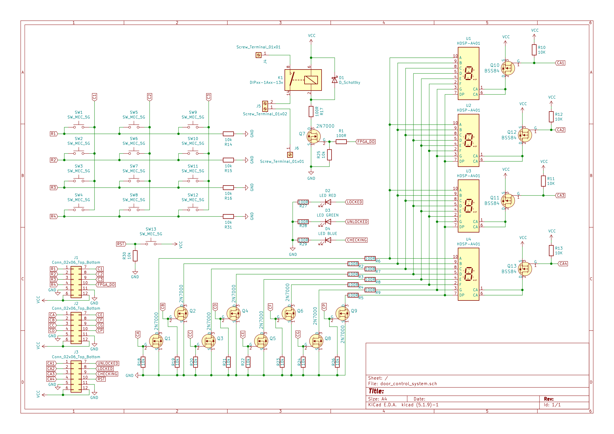

# Door lock system

Door lock system with PIN (4-digit) terminal, 4x3 push buttons, 4-digit 7-segment display, relay for door lock control.

### Team members

Filip Kocum 
Martin Knob
Vojtěch Hroch
Gregor Karetka 

[GitHub repository link](https://github.com/gkaretka/DE1-projekt)

### Project objectives

Build door lock system with 4x3 keyboard, 4-digit 7-segment display, relay for door control.

- 4x3 keyboard
   - mesh keyboard (instead of 12 inputs, only 4 inputs and 3 outputs are necessary)
   - deglitch system (keys are deglitched using own algorithm)
- 4-digit 7-segment display
  - displays entered numbers (when using input as unlock or as new pin input)
- relay for door control
  - relay is opened when correct pin is entered

- additional feature
  - 3x wrong data input delay (after 3 failed attempts to enter correct pin, system locks itself for 30 seconds)
  - unlock hold with reset (after entering correct pin, system is unlocked for 30 seconds unless reset button is pressed)
  - new pin enter system (when device is unlocked new pin can be set by entering digits numbers and pressing set button)
    - new pin is stored until device is hard reseted (done by user unaccessible button)

## Hardware description

### Simple hardware block diagram

### Schematic of hardware design

### Interconnection between Arty and our own board

## VHDL modules description and simulations

Write your text here.

## TOP module description and simulations

Write your text here.

## Video

*Write your text here.

## References

   1. Write your text here.
