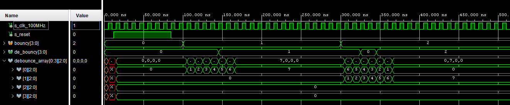
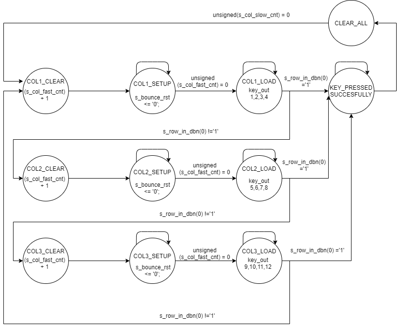

# Door lock system

Door lock system with PIN (4-digit) terminal, 4x3 push buttons, 4-digit 7-segment display, relay for door lock control.

### Team members

Filip Kocum, Martin Knob, Vojtěch Hroch, Gregor Karetka

[GitHub repository link](https://github.com/gkaretka/DE1-projekt)

### Project objectives

Build door lock system with 4x3 keyboard, 4-digit 7-segment display, relay for door control.

- 4x3 keyboard
   - mesh keyboard (instead of 12 inputs, only 4 inputs and 3 outputs are necessary)
   - deglitch system (keys are deglitched using own algorithm)
- 4-digit 7-segment display
  - displays entered numbers (when using input as unlock or as new pin input)
- relay for door control
  - relay is opened when correct pin is entered

- additional feature
  - 3x wrong data input delay (after 3 failed attempts to enter correct pin, system locks itself for 30 seconds)
  - unlock hold with reset (after entering correct pin, system is unlocked for 30 seconds unless reset button is pressed)
  - new pin enter system (when device is unlocked new pin can be set by entering digits numbers and pressing set button)
    - new pin is stored until device is hard reseted (done by user unaccessible button)

## Hardware description

### Simple hardware block diagram

### Schematic of hardware design

### Interconnection between Arty and our own board

## VHDL modules description and simulations

### debouncer
Debouncer is crude digital filter used for deglitching/debouncing incomming user input signals. These signals are rather noisy so this is important block for every system that handles user input in analog way. Single debouncer(in this application it is 4x debouncer) is block with one input and one output. It samples signal with main high speed clock. When input is high debouncer starts counting up on every clock tick, until reaching counter limit. Output of single debouncer is high when counter is more than our threshold (settable) othewise it is low. This prevens sudden changes on output and makes it more stable.

- [schematic](img/architecture_de_bouncer.jpg)
- sounce files
  - [debouncer.vhd](door_lock_system/door_lock_system.srcs/sources_1/new/de_bouncer.vhd)
- simulation files
  - [tb_debouncer.vhd](door_lock_system/door_lock_system.srcs/sim_1/new/tb_debouncer.vhd)

#### TB debouncer simulation

### keyboard
Keyboard is mesh controller used for decoding mesh input and transforming it to vector format used later in application. This module switched very fast between three columns of buttons and read four inputs or rows (these are going through debouncer first). After that it sets bit with index of our key in its output vector. It uses state machine to be consistent. There is built in feature that prevents multiple button press on one real press caused by very fast clock speed (that is used for sampling).

### Keyboard state diagram

- [schematic](img/architecture_key_board.jpg)
- sounce files
  - [keyboard.vhd](door_lock_system/door_lock_system.srcs/sources_1/new/key_board.vhd)
- simulation files
  - [tb_keyboard.vhd](door_lock_system/door_lock_system.srcs/sim_1/new/tb_keyboard.vhd)

#### TB keyboard simulation

### keyboard decoder
Keyboard decoder is simple module written for better code organization. It uses synchronous input from keyboard vector output and outputs structural data for later use in application. This block is basically interconnection between low level modules and high level application logic. By using this block we were able to write code faster because we do not need to take care of low level stuff. Output of this block is `command type` and `data type`. These two types store higher level information than simple logic vector.

- [schematic](img/architecture_keyboard_decoder.png)
- sounce files
  - [keyboard_decoder.vhd](door_lock_system/door_lock_system.srcs/sources_1/new/keyboard_decoder.vhd)
- simulation files
  - [tb_keyboard_decoder.vhd](door_lock_system/door_lock_system.srcs/sim_1/new/tb_keyboard_decoder.vhd)
  - [tb_keyboard_withraw_input.vhd](door_lock_system/door_lock_system.srcs/sim_1/new/tb_keyboard_withraw_input.vhd)

#### TB keyboard decoder simulation

### lock controller
Keyboard decoder is simple module written for better code organization. It uses synchronous input from keyboard vector output and outputs structural data for later use in application. This block is basically interconnection between low level modules and high level application logic. By using this block we were able to write code faster because we do not need to take care of low level stuff. Output of this block is `command type` and `data type`. These two types store higher level information than simple logic vector.

### Lock controller state diagram

- [schematic](img/architecture_lock_controller.png)
- sounce files
  - [lock_controller.vhd](door_lock_system/door_lock_system.srcs/sources_1/new/lock_controler.vhd)
- simulation files
  - [tb_lock_controller.vhd](door_lock_system/door_lock_system.srcs/sim_1/new/tb_lock_controller.vhd)
  - [tb_lock_controller_change_pin.vhd](door_lock_system/door_lock_system.srcs/sim_1/new/tb_lock_controller_change_pin.vhd)
  - [tb_lock_controller_failed.vhd](door_lock_system/door_lock_system.srcs/sim_1/new/tb_lock_controller_failed.vhd)

##### simple unlock (big picture, detail)

##### unlock and store new pin simulation
After setting new pin device automatically locks itself

#### fail simulation
Fail 3 times and then wait for security feature (30s real life, simulation is shorter) then unlock with correct pin

### pin storage
Basically stores pin in high level struture. This module allows changing of the pin on rising edge.

- [schematic](img/architecture_pin_storage.png)
- sounce files
  - [pin_storage.vhd](door_lock_system/door_lock_system.srcs/sources_1/new/pin_storage.vhd)
- simulation files
  - [tb_pin_storage.vhd](door_lock_system/door_lock_system.srcs/sim_1/new/tb_pin_storage.vhd)

##### store new pin simulation

### display driver
It has a common cathode. The display features one decimal point per digit. 4-digit seven segment display using a standard time-division multiplexing technique. At one time flash one digit. It's is the same principle as a monitor.

- [schematic](img/architecture_driver_7seg_4digits.png)
  - [clock_enable](img/architecture_clock_enable.png)
  - [cnt_up_down](img/architecture_cnt_up_down.png)
  - [hex_7seg](img/architecture_hex_7seg.png)
- sounce files
  - [clock_enable.vhd](door_lock_system/door_lock_system.srcs/sources_1/new/clock_enable.vhd)  
  - [cnt_up_down.vhd](door_lock_system/door_lock_system.srcs/sources_1/new/cnt_up_down.vhd)
  - [hex_7seg.vhd](door_lock_system/door_lock_system.srcs/sources_1/new/cnt_up_down.vhd)
  - [display_7seg_4digits.vhd](door_lock_system/door_lock_system.srcs/sources_1/new/display_7seg_4digits.vhd)
- simulation files
  - [tb_clock_enable.vhd](door_lock_system/door_lock_system.srcs/sim_1/new/tb_clock_enable.vhd)
  - [tb_hex_7seg.vhd](door_lock_system/door_lock_system.srcs/sim_1/new/tb_hex_7seg.vhd)
  - [tb_7seg_4digits.vhd](door_lock_system/door_lock_system.srcs/sim_1/new/tb_7seg_4digits.vhd)
  - [tb_cnt_up_down.vhd](door_lock_system/door_lock_system.srcs/sim_1/new/tb_cnt_up_down.vhd)
##### driver_7seg_4digits simulation

## TOP module description and simulations

### Tom module interconnection diagram (export RTL analysis)

### Top module simulation (unlock, set new pin, lock, unlock with new pin, lock with reset)

Top module is practically only to interconnect all submodules modules to the outer world and each other. This module has input of signals that are specified in XDC file and pipes them into induvidual modules. All modules are simulated independently and after passing all tests these modules are integrated into top module.

### To sum up

This device provides locking system with 4 digits pin, ability to change this pin, ability to be hard reset. Input pin is displayed on 4x 7-segment displays. This display is also used to view new pin when entering it. Relay is used to open solenoid locking mechanism or any other mechanical lock that needs higher current to be opened. Ground for logic and power systems are separated so no outer high voltage circuitry can harm sensitive electronics like FPGA.

## Video

*Write your text here.

## References

1. [(tomas-fryza/Digital-electronics-1)](https://github.com/tomas-fryza/Digital-electronics-1)
2. KALLSTROM, P. A Fairly Small VHDL Guide. Version 2.1.
3. Haskell, Richard. Hanna, Darrin. Introduction to Digital Design Using Digilent FPGA Boards ─ Block Diagram / Verilog Examples. Oakland University, Rochester, Michigan, 2009. ISBN 978-0-9801337-9-0.
